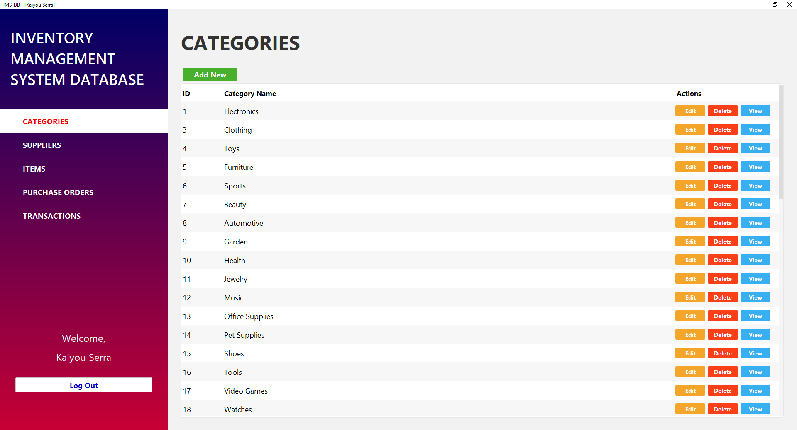

# Inventory Management System (IMS) - Final Exam Project



A modern Java Swing desktop application for managing inventory, categories, suppliers, items, and purchase orders. Built as a final exam project for Object-Oriented Programming.

## 📋 Features

- **Category Management**: Create, view, edit, and delete product categories
- **Item Management**: Manage inventory items with descriptions, pricing, and stock levels
- **Supplier Management**: Maintain supplier information and contact details
- **Transaction Tracking**: Record and monitor inventory transactions
- **Purchase Orders**: Create and manage purchase orders from suppliers
- **Modern UI**: Built with FlatLaf for a modern, responsive interface with multiple theme support
- **Database Integration**: MySQL backend for persistent data storage
- **Custom Table Rendering**: Enhanced table displays with action buttons and alternating row colors

## 🛠️ Technology Stack

| Component | Version |
|-----------|---------|
| **Java** | 23 |
| **Build Tool** | Apache Ant (NetBeans) |
| **GUI Framework** | Java Swing |
| **UI Theme** | FlatLaf 3.5.2 |
| **Database** | MySQL 8.0+ |
| **JDBC Driver** | MySQL Connector/J 9.1.0 |
| **Layout Manager** | AbsoluteLayout |

## 📦 Dependencies

All required JAR files are included in the `JAR_FILES/` directory:
- `flatlaf-3.5.2.jar` - Modern UI theming
- `flatlaf-extras-3.2.jar` - Additional FlatLaf components
- `jsvg-1.6.1.jar` - SVG rendering support
- `mysql-connector-j-9.1.0.jar` - MySQL JDBC driver
- `AbsoluteLayout.jar` - GUI layout management

## 🚀 Quick Start

### Prerequisites

1. **NetBeans IDE 14+** - [Download](https://netbeans.apache.org/download/)
2. **Java 23 JDK** - [Download](https://www.oracle.com/java/technologies/downloads/)
3. **MySQL Server 8.0+** - [Download](https://dev.mysql.com/downloads/mysql/)

### Setup Instructions

#### 1. Open Project in NetBeans

1. Launch NetBeans
2. Go to **File** → **Open Project**
3. Navigate to and select the `ims-db-exercises` folder
4. Click **Open Project**
5. NetBeans will automatically detect the Ant-based project configuration

#### 2. Create Database and Tables

1. Open a terminal and connect to MySQL:
```bash
mysql -u root -p
```

2. Create the database and tables:
```bash
mysql> source finals.sql
```
Or copy-paste the SQL from `finals.sql` file into MySQL client.

**Default test credentials from `finals.sql`:**
- Database: `finals`
- Sample user: `john` / `john`

#### 3. Configure Database Connection (if needed)

When the application launches, you'll be prompted for database credentials:
- **URL**: `jdbc:mysql://localhost:3306/finals`
- **Username**: `root` (or your MySQL username)
- **Password**: Your MySQL password

#### 4. Build the Project

In NetBeans:
1. Right-click the project name in the Projects panel
2. Select **Clean and Build** (or press Shift+F11)
3. Wait for "BUILD SUCCESSFUL" message

#### 5. Run the Application

In NetBeans:
1. Right-click the project name → **Run** (or press F6)
2. The application will launch with a database login dialog
3. Enter your MySQL credentials or use sample account (`john` / `john`)

## 📁 Project Structure

```
ims-db-exercises/
├── src/
│   ├── final_exam/              # Main application package
│   │   ├── MainForm.java        # Main application window
│   │   ├── MainForm.form        # NetBeans GUI form
│   │   ├── FlatLaf.properties   # UI theme configuration
│   │   ├── dialogs/             # Dialog windows
│   │   │   ├── category/        # Category CRUD dialogs
│   │   │   ├── item/            # Item CRUD dialogs
│   │   │   ├── supplier/        # Supplier CRUD dialogs
│   │   │   ├── transaction/     # Transaction dialogs
│   │   │   └── purchase/        # Purchase order dialogs
│   │   └── utils/               # Utility classes
│   │       ├── SQLConfig.java   # Database configuration
│   │       └── GradientPanel.java # Custom UI component
│   └── table/                   # Table rendering components
│       └── cell/                # Custom table cell editors/renderers
├── JAR_FILES/                   # External library JARs
├── nbproject/                   # NetBeans project configuration
├── build.xml                    # Ant build configuration
├── manifest.mf                  # JAR manifest
├── finals.sql                   # Database schema and sample data
└── README.md                    # This file
```

## 🔧 Development in NetBeans

### Editing Forms and Code

This project uses NetBeans form files (`.form`) which provide a visual UI designer:

1. **To edit UI**: Double-click any `.form` file → Opens visual form editor
2. **To edit code**: Double-click corresponding `.java` file → Opens code editor
3. **Auto-generated code**: Form designer generates code in the `initComponents()` method
4. **Custom logic**: Add your code outside of auto-generated sections (marked with comments)

### Building and Running

| Task | Method |
|------|--------|
| Build | Right-click project → **Clean and Build** (or Shift+F11) |
| Run | Right-click project → **Run** (or F6) |
| Debug | Right-click project → **Debug** (or Ctrl+Shift+F5) |
| Build JAR | Right-click project → **Build Package** |

### Useful NetBeans Shortcuts

| Shortcut | Action |
|----------|--------|
| Shift+F11 | Clean and Build |
| F6 | Run Project |
| Ctrl+Shift+F5 | Debug Project |
| Ctrl+Shift+I | Fix Imports |
| Alt+Insert | Generate Code |
| F3 | Go to Definition |

## 🗄️ Database Schema Overview

### Core Tables

- **users**: Application user accounts
- **Categories**: Product categories
- **Suppliers**: Supplier information
- **Items**: Inventory items linked to categories
- **Transactions**: Item transactions (stock movements)
- **PurchaseOrders**: Orders from suppliers
- **PurchaseOrderItems**: Line items in purchase orders

### Key Relationships

```
Categories ←─┬─→ Items
             └─→ Transactions

Suppliers ←─→ PurchaseOrders ←─→ PurchaseOrderItems ←─→ Items
```

## ⚠️ Common Issues & Solutions

### Issue: "Cannot find symbol" or compilation errors

**Solution**: 
1. Ensure all JAR files are properly referenced
2. Right-click project → **Properties** → **Libraries**
3. Verify all JARs in `JAR_FILES/` are listed
4. Clean and rebuild: Shift+F11

### Issue: MySQL connection refused

**Solution**: 
1. Verify MySQL server is running
2. Open MySQL command line: `mysql -u root -p`
3. Check database exists: `SHOW DATABASES;` (should show `finals`)
4. Verify JDBC driver path is correct in project properties
5. Test connection string: `jdbc:mysql://localhost:3306/finals`

### Issue: Application won't run after opening in NetBeans

**Solution**:
1. Try **Clean and Build** (Shift+F11)
2. Delete the `build/` folder manually and rebuild
3. Check Java version: Project Properties → Sources → Source/Binary Format = 23
4. Restart NetBeans if issues persist

### Issue: Dialogs not displaying correctly

**Solution**:
1. Right-click the `.form` file → **Reload Form**
2. In the form editor, check that FlatLaf theme is properly set
3. Verify `FlatLaf.properties` exists in `src/final_exam/`

### Issue: Build produces JAR but won't run

**Solution**:
The built JAR needs the JAR_FILES directory in the same location:
```bash
# Copy dependencies alongside JAR
cp -r JAR_FILES dist/
cd dist/
java -jar OOP_Final_Exam.jar
```

## 📦 Creating a Distribution Package

To create a standalone executable package:

1. **Build the JAR**: Right-click project → **Build Package**
2. **Locate JAR**: Look in `dist/OOP_Final_Exam.jar`
3. **Package dependencies**: Copy `JAR_FILES/` folder to the same directory as the JAR
4. **Create launcher script** (Windows):
```batch
@echo off
java -cp "JAR_FILES/*;OOP_Final_Exam.jar" final_exam.MainForm
pause
```

5. **Create launcher script** (Linux/Mac):
```bash
#!/bin/bash
java -cp "JAR_FILES/*:OOP_Final_Exam.jar" final_exam.MainForm
```

## 📚 Resources

- [NetBeans IDE](https://netbeans.apache.org/)
- [Java Swing Documentation](https://docs.oracle.com/javase/tutorial/uiswing/)
- [FlatLaf GitHub](https://github.com/JFormDesigner/FlatLaf)
- [MySQL JDBC Driver](https://dev.mysql.com/doc/connector-j/en/)
- [Apache Ant Documentation](https://ant.apache.org/manual/)

## 📄 License

This is an educational project created for the Object-Oriented Programming final exam.

## 👤 Author

Created by: kserra

---

**Last Updated**: April 2026  
**Java Version**: 23  
**Status**: Complete
